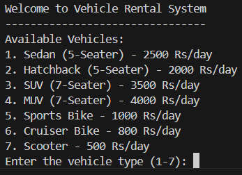
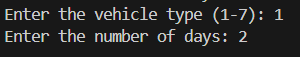
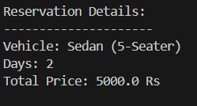

# Vehicle Rental System

## Description
The Vehicle Rental System is a simple Java console application that allows users to rent various types of vehicles by selecting a vehicle type and specifying the rental duration. The system calculates the total price based on the number of days the vehicle is rented.

## Features
- Uses **Abstraction** by defining an abstract `Vehicle` class.
- Implements **Inheritance**, where different vehicle types inherit from `Vehicle`.
- Demonstrates **Polymorphism** through the `Rentable` interface implemented by the `Reservation` class.
- Ensures proper **user input validation** for vehicle selection and rental days.

## How to Run
1. Compile the Java program:
   ```sh
   javac VehicleRental.java
   ```
2. Run the java program:
    ```sh
    java VehicleRental.java
    ```
## Features
- Implements **Abstraction**, **Inheritance**, and **Polymorphism**.
- **Exception Handling**: Prevents invalid user input.
- **Multithreading**: Simulates reservation processing.

## How It Works
1. User selects a vehicle.
2. User enters the number of rental days.
3. Reservation is processed in a separate thread to simulate processing time.

## Exception Handling
- Handles invalid vehicle selection.
- Handles non-numeric inputs for days selection.

## Multithreading
- The `Reservation` class implements `Runnable`.
- A separate thread handles reservation processing (`Thread.sleep(2000)`).

## Output






